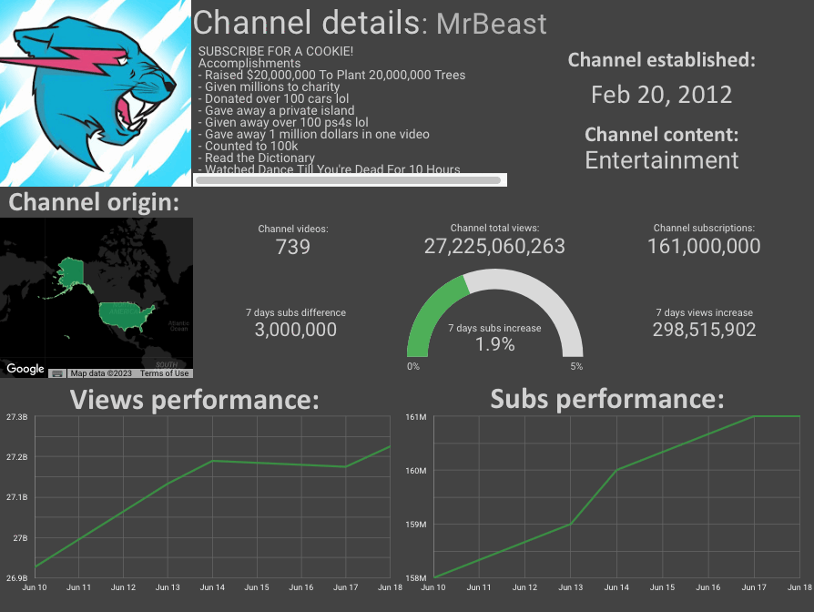
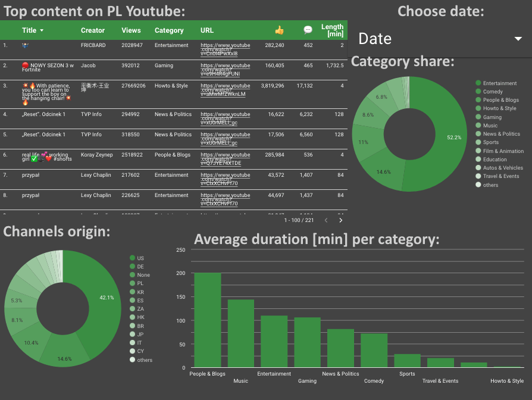
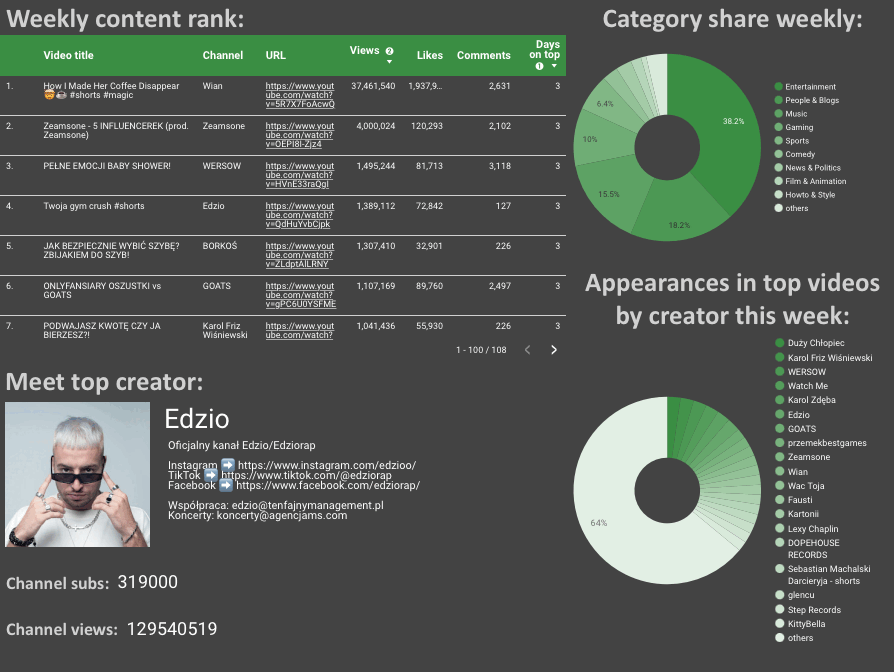
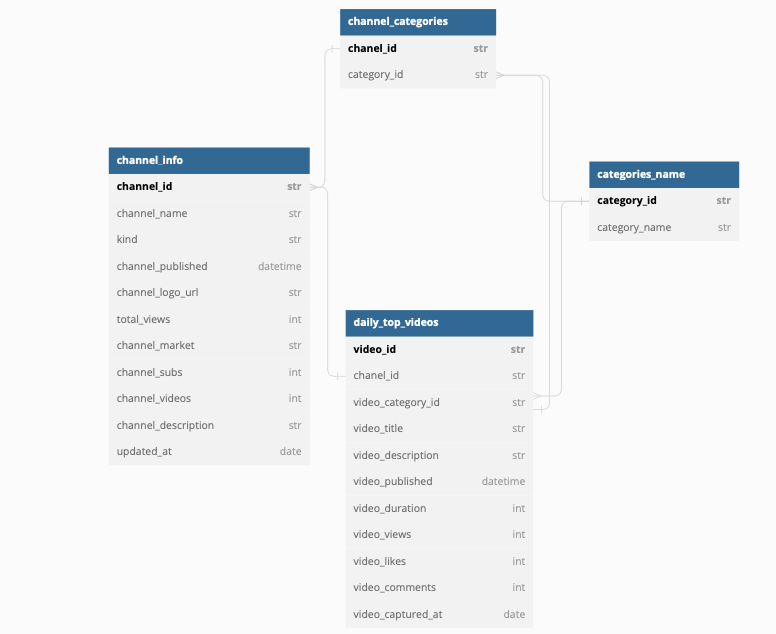
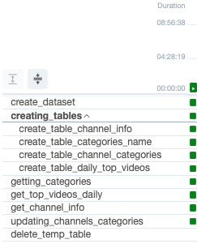

## 👨‍💻 Built with
        

##  Descripction about project

### ℹ️Project info

The YouTube Top Content Data Pipeline is an Airflow-based data pipeline that captures and analyzes top content on 
YouTube on chosen markets. 

It retrieves information about:
- the most popular videos on each day, 
- channels detailed information like a number of subs, number of videos, channel total views, 
- content categories,
Data API and stores the data in Google BigQuery for further analysis and visualisation in Looker Studio.

Airflow is launched daily and collects information about the 100 most popular movies in the market.


## 🔎 Looker Studio
Link to generated report in Looker:

[Youtbe top content report](https://lookerstudio.google.com/reporting/ffaa0888-b5ef-4c37-99ed-55806419ac20)

### Youtube top creators:


### Detailed informations about top content daily:


### Content on Youtube last week:



## 🗒️BigQuery database:

### Database diagram:


### Clustered tables:
- channel_info table (clustered by 'updated_at'), 
- daily_top_videos table (clustered by 'channel_id', 'video_category_id', 'video_captured_at'), 

## ⏩ DAG contains:




## 📦This project using 6 Docker containers:
- **Container with airflow-init**
    - Created to initialize Apache Airflow;
- **Container with airflow-webserver**
    - Created GUI to use Apache Airflow;
- **Container with airflow-triggerer**
- **Container with airflow-scheduler**
    - Created to deal with DAGs;
- **Container with PosgreSQL**
    - Created for Airflow using;

## Functionality:
The data pipeline performs the following tasks:

- Creates the necessary BigQuery dataset and tables to store the YouTube data.
- Retrieves the list of video categories from the YouTube Data API and stores them in the categories_name table.
- Retrieves the daily top videos from the YouTube Data API and stores them in the daily_top_videos table.
- Extracts the channel information for the channels associated with the daily top videos and stores it in the channel_info table.
- Updates the channel_categories table with the channel-category relationships extracted from the daily top videos.
- Cleans up temporary tables used during the pipeline execution.

## Dependencies

The pipeline relies on the following dependencies:

- Google Cloud SDK: Required for authentication and accessing Google Cloud services.
- Airflow: An open-source platform to programmatically author, schedule, and monitor workflows.
- Pandas: A data manipulation library used for processing data before storing it in BigQuery.
- Google API Python Client: Required for interacting with the YouTube Data API.
- Google Cloud BigQuery: The client library for Google BigQuery.

## Usage

To run the data pipeline, follow these steps:

- Set up a Google Cloud project and enable the YouTube Data API.
- Install the required dependencies as specified in the requirements.txt file.
- Update the config.yaml file with the appropriate project and dataset configuration.
- Execute the Airflow DAG Youtube_top_content_V2 either manually or based on a schedule.


## 🌲 Project tree
```bash
.
├── Dockerfile
├── README.md
├── dags
│   ├── youtube_dag
│   │   ├── config.yaml
│   │   ├── credentials.json
│   │   ├── methods.py
│   │   ├── schemas.py
│   │   └── youtube_secret_oauth.json
│   └── youtube_dag.py
├── docker-compose.yaml
├── images
├── docker-compose.yaml 
├── logs 
└──requirements.txt 

```
## 🔑 Setup 
The following configuration parameters are used:

### ./dag/youtube_dag/config.yaml:
- PROJECT_ID: The ID of the Google Cloud project where the data will be stored.
- DATASET_NAME: The name of the BigQuery dataset to be created.
- TABLE_CHANNEL_INFO: The name of the table to store channel information.
- TABLE_CHANNEL_CATEGORIES: The name of the table to store channel-category relationships.
- TABLE_CATEGORIES_NAME: The name of the table to store video category information.
- TABLE_DAILY_TOP_VIDEOS: The name of the table to store daily top videos.
- TEMP_TABLE_CHANNEL_X_CATEGORIES: The name of the temporary table used during the channel-category update.
- JSON_KEY_BQ: The path to the JSON key file for accessing Google Cloud services.

### ./docker-compose.yaml:
#### Environment:
- AIRFLOW_CONN_GOOGLE_CLOUD_DEFAULT: 'google-cloud-platform://?key_path=%2Fopt%2Fairflow%2Fdags%2F**YOUR-JSON-KEY-IN-THIS-FOLDER**.json&scope=https%3A%2F%2Fwww.googleapis.com%2Fauth%2Fcloud-platform&project=**YOUR-PROJECT-ID**&num_retries=5'
#### Database:
- POSTGRES_USER: 
- POSTGRES_PASSWORD:
- POSTGRES_DB:


## ⚙️ Run Locally
- Clone the project
- Go to the project directory:

Now create image of needed airflow extension:
```bash
  $ docker build -t extending_airflow:latest .
```
When created, to initialize airflow type:
```bash
  $ docker-compose up airflow-init 
```
Next run build of all other images needed:
```bash
  $ docker-compose up -d
```
Now airflow will start working.
If you want to stop airflow:
```bash
  $ docker-compose down -v
```

## ⚙️ Open airflow
**When all containers running, open browser and type:**
```bash
  localhost:8080
```
Next type password and username.

## ⚙️ Setting up Looker custom queries:

### Getting 7 days views difference:
```ruby
SELECT
  channel_id,
  channel_name,
  (
    SELECT MAX(total_views)
    FROM `PROJECT_ID.DATASET_ID.channel_info`
    WHERE channel_id = t.channel_id
      AND DATE(updated_at) = CURRENT_DATE()
  ) - (
    SELECT MAX(total_views)
    FROM `PROJECT_ID.DATASET_ID.channel_info`
    WHERE channel_id = t.channel_id
      AND DATE(updated_at) = DATE_SUB(CURRENT_DATE(), INTERVAL 7 DAY)
  ) AS views_difference
FROM
  `PROJECT_ID.DATASET_ID.channel_info` AS t
GROUP BY
  channel_id, channel_name;

```
### Getting 7 days subs difference with 7 days subs increase:
```ruby
SELECT
  channel_id,
  channel_name,
  (
    SELECT MAX(channel_subs)
    FROM `PROJECT_ID.DATASET_ID.channel_info`
    WHERE channel_id = t.channel_id
      AND DATE(updated_at) = CURRENT_DATE()
  ) - (
    SELECT MAX(channel_subs)
    FROM `PROJECT_ID.DATASET_ID.channel_info`
    WHERE channel_id = t.channel_id
      AND DATE(updated_at) = DATE_SUB(CURRENT_DATE(), INTERVAL 7 DAY)
  ) AS subs_difference,
  (
    (
      SELECT MAX(channel_subs)
      FROM `PROJECT_ID.DATASET_ID.channel_info`
      WHERE channel_id = t.channel_id
        AND DATE(updated_at) = CURRENT_DATE()
    ) - (
      SELECT MAX(channel_subs)
      FROM `PROJECT_ID.DATASET_ID.channel_info`
      WHERE channel_id = t.channel_id
        AND DATE(updated_at) = DATE_SUB(CURRENT_DATE(), INTERVAL 7 DAY)
    )
  ) / (
    SELECT MAX(channel_subs)
    FROM `PROJECT_ID.DATASET_ID.channel_info`
    WHERE channel_id = t.channel_id
      AND DATE(updated_at) = DATE_SUB(CURRENT_DATE(), INTERVAL 7 DAY)
  ) AS subs_increase_percent
FROM
  `PROJECT_ID.DATASET_ID.channel_info` AS t
GROUP BY
  channel_id, channel_name;

```

### Getting top videos from last 7 days:
```ruby
SELECT
  dtv.video_title,
  ci.channel_name,
  CONCAT('https://www.youtube.com/watch?v=', dtv.video_id) AS URL,
  COUNT(DISTINCT DATE(dtv.video_captured_at)) AS days_on_top,
  MAX(dtv.video_views) AS views,
  MAX(dtv.video_likes) AS likes,
  MAX(dtv.video_comments) AS comments,
  ci.channel_logo_url,
  ci.channel_description,
  cn.category_name,
  MAX(ci.total_views) AS total_views,
  MAX(ci.channel_subs) AS channel_subs
FROM (
  SELECT *
  FROM `PROJECT_ID.DATASET_ID.daily_top_videos`
  WHERE DATE(video_captured_at) BETWEEN DATE_SUB(CURRENT_DATE(), INTERVAL 1 WEEK) AND CURRENT_DATE()
) AS dtv
LEFT JOIN `PROJECT_ID.DATASET_ID.categories_name` AS cn
  ON dtv.video_category_id = cn.category_id
LEFT JOIN `PROJECT_ID.DATASET_ID.channel_info` AS ci
  ON dtv.channel_id = ci.channel_id
GROUP BY dtv.video_title, dtv.video_id, ci.channel_name, ci.channel_logo_url, ci.channel_description, cn.category_name
ORDER BY days_on_top DESC;
```
